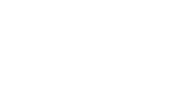

<div align="center">
  
  <h1>1to1 Digital Solutions Landing Page</h1>
  <p><strong>We build your technology, you build your business.</strong></p>
  
  <p>
    Built with Next.js 15, React 19, Three.js, React Three Fiber, Framer Motion, GSAP, and Tailwind CSS v4.
  </p>
</div>

<hr />

## 🚀 Overview

The **1to1 Digital Solutions Landing Page** represents a high-end, luxury tech agency aesthetic. It strongly emphasizes performant 3D graphics, seamless scroll animations, and an interactive puzzle-driven Hero section to engage ambitious Web3 and SaaS startups.

The objective of this project is to communicate that “Logic Is Everything” and that 1to1 Digital Solutions provides senior-level execution, handling robust Cloud Infrastructures, MVP Development, and Mixed Reality.

## ✨ Key Features

- **Interactive 3D Hero Puzzle:** Built using `@react-three/fiber` and `@react-three/drei`. Users must drag and drop WebGL geometric constructs into wireframe slots to "connect" the puzzle, unlocking an interactive, distorted plasma globe.
- **GSAP Stacking Cards:** As you scroll through the page, sections pin dynamically and visually stack beneath the next section smoothly, creating deep spatial layers.
- **Beautiful Hover Physics:** Fully CSS-driven interactive hover effects including:
  - MVP Rocket vibrating and "launching" with a simulated smoke trail.
  - A responsive 3D CSS grid activating on hover for the Mixed Reality service card.
- **Internationalization (i18n):** Native bilingual implementation (Spanish / English) using a clean `LanguageContext.tsx` integration with zero Next.js App Router overhead.
- **Fully Responsive:** Fluid scaling typography and layouts that look perfect from `375px` mobile screens up to `1440px+` desktops.

## 🛠 Tech Stack

- **Framework:** Next.js (App Router) + React (Client Components focused for 3D/Animations)
- **Styling:** Tailwind CSS v4
- **3D Graphics & WebGL:** `three.js`, `@react-three/fiber`, `@react-three/drei`
- **Animations:** GSAP (ScrollTrigger), Framer Motion, Vanilla CSS Keyframes
- **Icons:** Lucide React
- **Tooling:** ESLint (Flat Config), Prettier, Jest, React Testing Library

## 📦 Getting Started

### Prerequisites

Ensure you have **Node.js** (v18+) and **npm** installed on your machine.

### Installation

1. Clone the repository and navigate into the project directory:
   ```bash
   git clone git@github.com:1to1-Digital-Solutions/website.git
   cd website
   ```
2. Install dependencies:
   ```bash
   npm install
   ```

### Development Server

Start the interactive development environment:

```bash
npm run dev
```

Open [http://localhost:3000](http://localhost:3000) with your browser to see the result.

## 🧹 Linting & Formatting

We strictly enforce code consistency using **ESLint** and **Prettier**.

- **To detect lint errors:**
  ```bash
  npm run lint
  ```
- **To format code automatically:**
  ```bash
  npm run format
  ```

_Note: Prettier automatically sorts Tailwind classes leveraging the `prettier-plugin-tailwindcss` core plugin._

## 🧪 Testing

The codebase maintains strict test coverage over contexts, UI structural renders, and static markup utilizing Jest & React Testing Library.

**To run tests iteratively:**

```bash
npm run test
```

## 📄 License & Legal

All original source code and designs under this repository are proprietary to 1to1 Digital Solutions pending client handoffs or specific open-source releases. See the attached `terms-conditions` routing for details.
